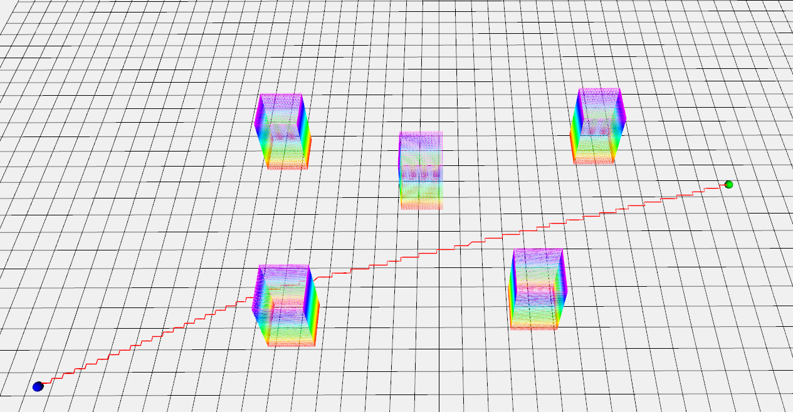

## Jps3d

This repository implements 3D Jump Point Search (JPS) for ROS environments.

JPS excels at fast pathfinding in sparse grids. To enhance usability, I extracted the algorithm from [jps3d](https://github.com/KumarRobotics/jps3d.git) and reorganized the package to be compatible with ROS1. Additionally, I revamped the interfaces to make it **plug-and-play** for any application.




## Quick Start

**Step 1**: Download the dependencies:

```shell
sudo apt update
sudo apt install ros-$ROS_DISTRO-octomap
sudo apt install ros-$ROS_DISTRO-octomap-server
sudo apt install ros-$ROS_DISTRO-pcl-ros
```

**Step 2**: Initialize the repository and compile:

```shell
git clone https://github.com/Dwl2021/Dynamic-Astar.git
cd Dynamic-Astar
catkin_make
```

**Step 3**: Run the main program:

```shell
./run.sh
```


## Parameters

### Set start and goal

Modify in `src/plan_manage/launch/example.launch`
```cpp
<param name="start_x" value="0" />
<param name="start_y" value="0" />
<param name="start_z" value="1" />
<param name="goal_x" value="30" />
<param name="goal_y" value="10" />
<param name="goal_z" value="1" />
```

### Path search parameters

Modify in `src/plan_manage/launch/jps3d.xml`

```xml
<launch>
  <!-- map -->
  <param name="map/x_size" value="100" />
  <param name="map/y_size" value="100" />
  <param name="map/z_size" value="2" />
  <param name="map/origin_x" value="-50" />
  <param name="map/origin_y" value="-50" />
  <param name="map/origin_z" value="0" />
  <param name="map/resolution" value="0.2" />
  <param name="map/world_frame_id" value="world" />

  <!-- jps -->
  <param name="world_frame_id" value="world" type="string" />
  <param name="jps/resolution" value="0.1" type="double" />
  <param name="jps/lambda_heu" value="1.0" type="double" />
  <param name="jps/allocate_num" value="500000" type="double" />
</launch>
```

### Point cloud map
Modify in `src/map_pcl/pcd` and if you want to make your own map, more details can be found in `src/map_pcl/pcd/map_generation.txt`.

Or if you want to use the existing point cloud, you can change your point cloud map topic to be `/global_map`.

## Other similar package

[Dynamic-Astar](https://github.com/Dwl2021/Dynamic-Astar)
